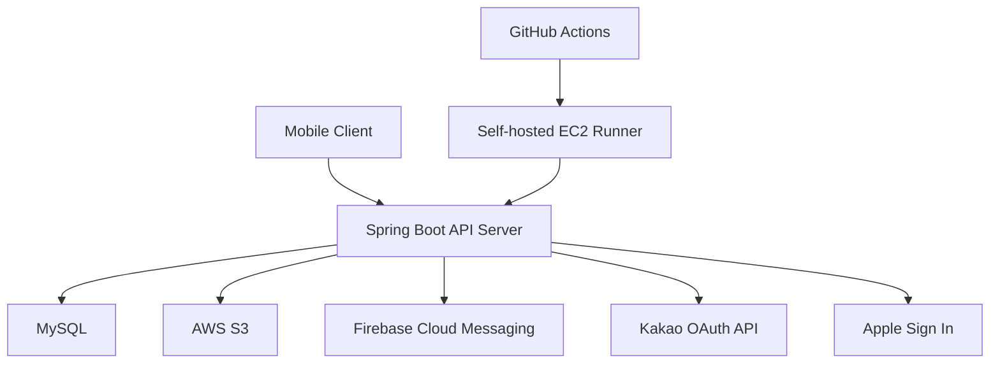

Detoxmate는 친구들과 함께 디지털 디톡스 챌린지를 만들고, 스크린타임 목표 달성 여부를 기록하며, 피드와 알림으로 서로의 지속을 돕는 모바일 서비스 백엔드입니다.

## 프로젝트 개요

- 프로젝트명: Detoxmate
- 개발 기간: 작성 필요
- 개발 인원: PM 1명, PD 2명, FE 2명, BE 2명
- 담당 역할: 백엔드 개발
- 프로젝트 목적: 디지털 디톡스를 혼자만의 의지 문제가 아니라 친구들과 함께 검증하고 지속하는 경험으로 만들기

Detoxmate는 PM, PD, FE, BE가 함께 사용자의 디지털 디톡스 문제를 정의하고, 다양한 제품 가설을 우선순위화해 MVP 스펙으로 빠르게 검증하는 프로젝트입니다. 데이터와 유저 반응을 기반으로 기능의 지속 여부를 판단하며, 효과가 약한 가설은 과감하게 버리고 핵심 경험에 집중하는 방식으로 제품을 만들어가고 있습니다.

## 기술 스택

| 구분 | 기술 |
|---|---|
| Language | Java 21 |
| Framework | Spring Boot 4.0.5, Spring Web, Spring Validation |
| Auth / Security | Spring Security OAuth2 JOSE, Spring Security Crypto, JJWT |
| Database | MySQL 8.4, Spring Data JPA, Spring Data JDBC, H2 Test |
| API Docs | Spring REST Docs, restdocs-api-spec, springdoc OpenAPI, Swagger UI |
| External Integration | Firebase Admin SDK, AWS SDK S3, Kakao API, Apple Sign In, Discord Webhook |
| Monitoring | Spring Boot Actuator, Micrometer Prometheus |
| Test | JUnit 5, Spring Boot Test, MockMvc, Data JPA Test |
| Infra / CI/CD | Docker, Docker Compose, GitHub Actions, EC2 self-hosted runner |
| Build | Gradle |

- `Spring Boot + JPA`: 도메인 상태 변경과 영속성 흐름을 Spring 생태계 안에서 일관되게 구현하기 위해 사용했습니다.
- `JWT + Refresh Token Session`: 모바일 클라이언트의 로그인 유지와 토큰 재발급 흐름을 분리하기 위해 사용했습니다.
- `Firebase Admin SDK`: 챌린지 인증, 댓글, 리액션, 찌르기, 리마인더 등 사용자 행동 기반 푸시 알림을 발송하기 위해 사용했습니다.
- `AWS S3 Presigned URL`: 프로필 이미지, 활동 인증 이미지, OCR 오류 신고 이미지 업로드를 서버 부하 없이 처리하기 위해 사용했습니다.
- `Spring REST Docs + OpenAPI`: Controller 테스트를 기반으로 API 문서를 생성해 FE와의 스펙 싱크 비용을 줄이기 위해 사용했습니다.
- `Actuator + Prometheus`: 배포 후 health check와 기본 메트릭 수집을 위해 사용했습니다.

## 아키텍처



- 전체 구조: 모바일 클라이언트가 Spring Boot API 서버를 호출하고, 서버가 MySQL에 핵심 도메인 데이터를 저장합니다.
- 인증 흐름: Kakao, Apple 소셜 로그인을 통해 사용자를 식별하고 JWT access token과 refresh token을 발급합니다.
- 파일 업로드 흐름: 클라이언트가 업로드 목적을 전달하면 서버가 S3 presigned URL을 발급하고, 이미지는 클라이언트가 S3로 직접 업로드합니다.
- 알림 흐름: 도메인 이벤트를 기반으로 FCM 푸시 알림을 발송하고, 알림 이력과 내비게이션 정보를 저장합니다.
- 문서화 흐름: Controller 테스트에서 REST Docs snippet과 OpenAPI spec을 생성하고 Swagger UI로 확인합니다.
- 배포 흐름: `dev`와 `main` 브랜치 push 시 GitHub Actions가 JAR를 빌드하고 EC2 self-hosted runner에서 Docker 컨테이너를 재기동합니다.

## ERD 설계

ERD 이미지: 작성 필요


핵심 설계는 그룹 소속, 챌린지 참가, 앱 사용 목표, 인증 기록을 분리해 MVP 정책은 단순하게 유지하면서도 이후 시즌제 챌린지로 확장할 수 있게 하는 것입니다.

- `users`: 사용자 프로필과 서비스 상태를 관리합니다.
- `social_login_users`: Kakao, Apple 등 소셜 계정과 서비스 사용자의 연결을 관리합니다.
- `refresh_token_sessions`: refresh token 세션을 저장해 재발급, 로그아웃, 탈퇴 흐름을 제어합니다.
- `groups`: 친구들이 모이는 지속 가능한 모임입니다. 챌린지가 끝나도 그룹은 유지됩니다.
- `group_members`: 유저와 그룹의 소속 관계를 나타냅니다. 방장 권한과 탈퇴 상태를 그룹 레벨에서 관리합니다.
- `group_challenges`: 그룹이 특정 기간 동안 진행하는 한 번의 디지털 디톡스입니다.
- `group_challenge_participants`: 유저가 특정 챌린지에 실제로 참가했는지 나타냅니다.
- `usage_goal_type`, `user_usage_goal_times`: 앱별 목표 시간 타입과 사용자 목표 시간을 관리합니다.
- `activity_record`, `activity_record_detail`: 스크린타임 인증 기록과 앱별 상세 사용 시간을 저장합니다.
- `challenge_record_status_count`: 챌린지 인증 상태 집계를 별도 테이블로 분리해 피드/캘린더 조회 비용을 줄입니다.
- `comments`, `reactions`, `pokes`: 챌린지 인증 기록에 대한 소셜 피드 상호작용을 관리합니다.
- `notification`, `notification_type`, `notification_history`, `fcm_token`: 알림 템플릿, 발송 대상, 알림 이력, 디바이스 토큰을 분리합니다.
- `screen_time_ocr_error_report`: OCR 인식 실패 또는 오인식 사례를 수집하고 관리자 검토 상태를 관리합니다.

그룹 도메인에서는 `Group`, `GroupMember`, `GroupChallenge`, `GroupChallengeParticipant`를 분리했습니다. 그룹은 사람들의 모임이고, 챌린지는 한 번의 디톡스 시즌이며, 참가자는 시즌별 참여 상태와 목표 시간 스냅샷을 갖기 때문입니다. 이 구조는 MVP에서는 "그룹 참여와 챌린지 참여를 단순한 경험으로 제공"하면서도, 이후 "그룹에는 남고 이번 시즌만 쉬기" 같은 정책으로 확장할 수 있습니다.

## 주요 기능

### 인증 / 사용자

- Kakao, Apple 소셜 로그인
- JWT access token 발급과 refresh token 기반 재발급
- 로그아웃, 회원 탈퇴, 소셜 계정 연결 해제
- 내 프로필 조회/수정
- 푸시 알림 수신 설정 변경
- 개발 환경용 테스트 로그인

### 그룹 / 챌린지

- 그룹 생성, 초대코드 기반 그룹 참여
- 내 그룹 목록 조회, 그룹 상세 조회, 그룹 정보 수정
- 그룹 탈퇴와 멤버 상태 관리
- 내 챌린지 목록 조회, 챌린지 상세 조회
- 그룹 멤버 프로필과 챌린지 참여 정보 조회
- 그룹 활동 캘린더와 일별 인증 상태 조회

### 스크린타임 목표 / 활동 기록

- 사용자별 앱 사용 목표 시간 설정
- 현재 목표 시간 조회
- 최초 스크린타임 기록 등록/조회
- 활동 기록 달성 여부 확인
- 활동 기록과 앱별 사용 시간 상세 저장

### 피드 / 소셜 인터랙션

- 그룹 챌린지 개요 조회
- 홈 피드와 멤버별 인증 현황 조회
- 오늘의 챌린지 인증 기록 조회
- 챌린지 인증 기록 목록/상세 조회
- 댓글 작성/조회
- 리액션 생성/삭제
- 찌르기 생성

### 알림

- FCM 토큰 등록/삭제
- 알림 이력 목록 조회
- 알림 클릭 시 이동 정보 조회
- 인증, 댓글, 리액션, 찌르기, 그룹 참여, 목표 설정 리마인더 이벤트 처리
- 일일/주간 알림 스케줄링

### 이미지 업로드 / OCR 오류 신고

- 업로드 목적별 S3 presigned URL 발급
- 프로필 이미지, 활동 인증 이미지, OCR 오류 신고 이미지 업로드 경로 분리
- 스크린타임 OCR 오류 신고 생성
- 관리자용 OCR 오류 신고 목록/상세/상태 변경
- OCR 오류 신고 발생 시 Discord Webhook 알림

### 개발 / 운영 지원

- 로컬 fixture API를 통한 활동 캘린더 테스트 데이터 생성
- 관리자 검토 토큰 기반 보호
- API 요청/응답 로그와 민감정보 마스킹
- Swagger UI 기반 API 문서 확인

## 테스트

핵심 도메인 로직에 대한 단위 테스트, JPA Repository 테스트, Controller 테스트, REST Docs 기반 문서화 테스트, 일부 End-to-End HTTP API 테스트를 작성했습니다.

- 도메인 테스트: `Group`, `GroupMember`, `GroupChallenge`, `ChallengeRecord`, `ActivityRecord`, `Notification`, `Reaction`, `Poke` 등 상태 변경과 불변식 검증
- 서비스 테스트: 인증, 그룹, 챌린지, 피드, 활동 기록, 알림, OCR 오류 신고 유스케이스 검증
- Repository 테스트: JPA 매핑, 조회 조건, 연관 데이터 조회 검증
- Controller 테스트: 요청 검증, 인증 사용자 처리, 응답 스펙 검증
- 문서화 테스트: REST Docs snippet과 OpenAPI 문서 생성
- 테스트 파일 수: 117개

주요 검증 명령은 다음과 같습니다.

```bash
./gradlew test
./gradlew clean build
```

## 실행 방법

### 1. Repository Clone

```bash
git clone https://github.com/DDD-Community/detox.mate-be.git
cd detox.mate-be
```

### 2. 환경 변수 설정

로컬 프로필은 `.env.local`을 선택적으로 읽습니다.
Firebase 로컬 실행에는 다음 파일이 필요합니다.

```text
src/main/resources/firebase/detoxmate-dev-firebase-account.json
```
저장소에는 구조 공유용 예시 파일만 포함되어 있습니다.
```text
src/main/resources/firebase/service-account.example.json
```

### 4. 애플리케이션 실행

```bash
./gradlew bootRun
```

로컬 기본 포트는 `8080`입니다.

### 5. API 문서 확인

```text
http://localhost:8080/swagger-ui.html
```

OpenAPI spec은 테스트 기반으로 생성됩니다.

```bash
./gradlew openapi3
```

## API 문서

Swagger UI는 `/swagger-ui.html`에서 확인할 수 있으며, OpenAPI YAML은 `/openapi3.yaml`로 제공됩니다. 문서 스펙은 Controller 테스트와 Spring REST Docs를 기반으로 생성되어 FE와 BE가 같은 API 계약을 확인할 수 있도록 구성했습니다.

## 개발 원칙

- 제품 가설을 우선순위화하고 MVP 단위로 빠르게 검증합니다.
- 유저 반응과 데이터를 기반으로 다음 기능을 결정합니다.
- 효과가 낮은 가설은 빠르게 버리고 핵심 사용자 경험에 집중합니다.
- 패키지는 기술 계층보다 도메인 단위로 먼저 나눕니다.
- 비즈니스 규칙은 가능한 한 Service가 아니라 Domain Model에 둡니다.
- 의존성은 외부 계층에서 Domain 방향으로 흐르게 유지합니다.
