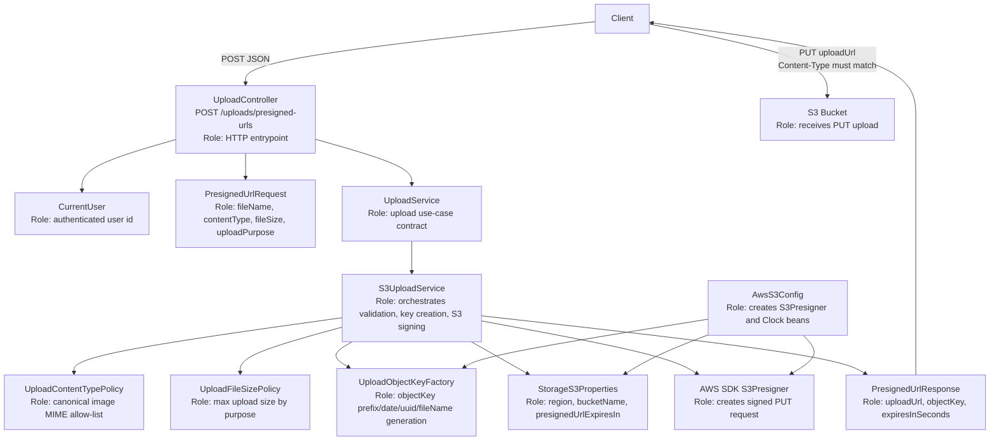
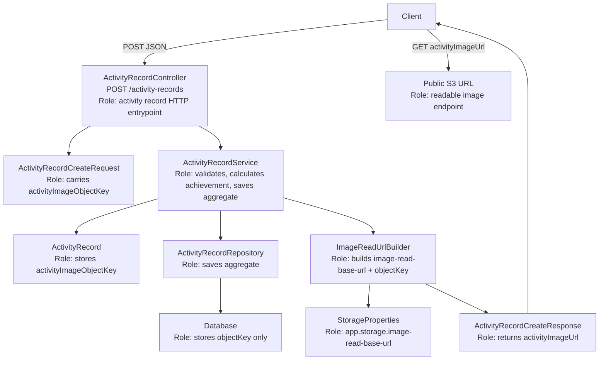

# S3 Storage Setup

## 1. Purpose

Detoxmate uses Amazon S3 to store user-uploaded images.

Current upload targets:

- Activity record images
- Profile images

The backend issues presigned URLs from `POST /uploads/presigned-urls`.
The client uploads the file directly to S3, then sends the returned `objectKey` to the final save API.

## 2. Current Bucket

| Item | Value |
| --- | --- |
| Bucket name | `detoxmate-media-dev` |
| Bucket ARN | `arn:aws:s3:::detoxmate-media-dev` |
| Region | `ap-northeast-2` |
| S3 base URL | `https://detoxmate-media-dev.s3.ap-northeast-2.amazonaws.com` |

Object URL format:

```text
https://detoxmate-media-dev.s3.ap-northeast-2.amazonaws.com/{objectKey}
```

Initial decision: image prefixes are publicly readable.
The application uses this S3 base URL as the image read base URL during the first phase.

## 3. Object Key Prefixes

The backend creates object keys under fixed prefixes.
The client must not decide S3 paths directly.

| Upload purpose | Object key shape |
| --- | --- |
| `ACTIVITY_RECORD_IMAGE` | `activity-records/{userId}/{yyyy}/{MM}/{uuid}-{sanitizedFileName}` |
| `PROFILE_IMAGE` | `profile-images/{userId}/{uuid}-{sanitizedFileName}` |

## 4. Application Config

Local config is loaded from `.env.local`.

Current local values:

```properties
AWS_REGION=ap-northeast-2
S3_BUCKET_NAME=detoxmate-media-dev
S3_PRESIGNED_URL_EXPIRES_IN=600
```

Spring config path:

```yaml
app:
  storage:
    image-read-base-url: ${STORAGE_IMAGE_READ_BASE_URL:https://detoxmate-media-dev.s3.ap-northeast-2.amazonaws.com}
    s3:
      region: ${AWS_REGION:ap-northeast-2}
      bucket-name: ${S3_BUCKET_NAME:detoxmate-media-dev}
      presigned-url-expires-in: ${S3_PRESIGNED_URL_EXPIRES_IN:600}
```

`image-read-base-url` points to the public S3 endpoint during the first phase.
When CloudFront is introduced later, only this value should change.

## 5. IAM Policy

The backend needs permission to create presigned upload URLs.
For PUT presigned URLs, the signing principal needs `s3:PutObject` on the target object paths.

Policy example:

```json
{
  "Version": "2012-10-17",
  "Statement": [
    {
      "Sid": "AllowPresignedUploadToDetoxmateMediaDev",
      "Effect": "Allow",
      "Action": [
        "s3:PutObject"
      ],
      "Resource": [
        "arn:aws:s3:::detoxmate-media-dev/activity-records/*",
        "arn:aws:s3:::detoxmate-media-dev/profile-images/*"
      ]
    }
  ]
}
```

## 6. Public Read Bucket Policy

The first-phase read strategy uses public S3 URLs for user images.
Do not make the entire bucket public. Only expose the image prefixes that are intended to be readable by clients.

Policy example:

```json
{
  "Version": "2012-10-17",
  "Statement": [
    {
      "Sid": "PublicReadUserImages",
      "Effect": "Allow",
      "Principal": "*",
      "Action": "s3:GetObject",
      "Resource": [
        "arn:aws:s3:::detoxmate-media-dev/activity-records/*",
        "arn:aws:s3:::detoxmate-media-dev/profile-images/*"
      ]
    }
  ]
}
```

This means that anyone who knows an image URL under these prefixes can read it.
Do not store private or sensitive files under these prefixes.

## 7. Upload Contract

Allowed upload content types:

- `image/jpeg`
- `image/png`
- `image/webp`
- `image/heic`
- `image/heif`

Values must be canonical and lowercase, because the same `Content-Type` is signed into the later S3 `PUT` request.

Current server-side presign guardrails:

| Upload purpose | Max size |
| --- | --- |
| `PROFILE_IMAGE` | 5MB |
| `ACTIVITY_RECORD_IMAGE` | 10MB |

These limits are checked before issuing the presigned URL. S3 still receives a regular presigned `PUT` URL.

## 8. Code Dependency Map

The S3 feature has two separate paths:

- Upload path: issue a presigned `PUT` URL.
- Read path: turn a stored `objectKey` into a public image URL for API responses.

### 8-1. Presigned upload dependencies



Dependency notes:

- `UploadController` does not know S3. It only receives HTTP input and delegates to `UploadService`.
- `S3UploadService` is the only application service that knows about `S3Presigner`.
- `UploadContentTypePolicy`, `UploadFileSizePolicy`, and `UploadObjectKeyFactory` keep policy decisions out of `S3UploadService`.
- `StorageS3Properties` is used only for upload signing settings, not for read URL generation.
- `PresignedUrlResponse.uploadUrl` is temporary and must not be stored in the database.
- `PresignedUrlResponse.objectKey` is the stable identifier that the client sends to the final domain API.

### 8-2. Image read URL dependencies



Dependency notes:

- `ActivityRecordCreateRequest.activityImageObjectKey` is already-uploaded S3 object identity.
- `ActivityRecord` stores `activityImageObjectKey`, not a full URL.
- `ActivityRecordService` asks `ImageReadUrlBuilder` to derive `activityImageUrl` only when building the response.
- `StorageProperties.imageReadBaseUrl` is the read URL base. In the first phase it is the public S3 endpoint.
- If the project later moves to CloudFront, only `app.storage.image-read-base-url` should change. Stored DB values should remain valid.

### 8-3. File responsibilities

| File | Responsibility | Depends on |
| --- | --- | --- |
| `UploadController` | HTTP endpoint for presigned URL issuance | `UploadService`, `CurrentUser`, `PresignedUrlRequest` |
| `UploadService` | Upload use-case interface | `PresignedUrlRequest`, `PresignedUrlResponse` |
| `S3UploadService` | Actual presigned `PUT` URL implementation | `S3Presigner`, `StorageS3Properties`, upload policies, key factory |
| `UploadContentTypePolicy` | Accepted image MIME policy | none |
| `UploadFileSizePolicy` | Max file size policy by `UploadPurpose` | `UploadPurpose` |
| `UploadObjectKeyFactory` | Object key generation | `Clock`, `UploadPurpose` |
| `AwsS3Config` | AWS SDK and time bean configuration | `StorageS3Properties` |
| `StorageS3Properties` | Upload signing config | Spring `app.storage.s3.*` |
| `StorageProperties` | Image read URL config | Spring `app.storage.image-read-base-url` |
| `ImageReadUrlBuilder` | Response image URL generation | `StorageProperties` |
| `ActivityRecordService` | Stores object key and builds response image URL | `ImageReadUrlBuilder`, repositories |
| `PresignedUrlRequest` | Upload URL request DTO | validation annotations, `UploadPurpose` |
| `PresignedUrlResponse` | Upload URL response DTO | none |
| `UploadPurpose` | Upload purpose enum | none |

## 9. Image Read Strategy

Decision: start with public S3 image reads.

Read URL shape:

```text
{image-read-base-url}/{objectKey}
```

Example:

```text
https://detoxmate-media-dev.s3.ap-northeast-2.amazonaws.com/activity-records/1/2026/04/{uuid}-walk-photo.png
```

Required AWS setup:

- Keep presigned upload writes restricted by IAM.
- Allow public `s3:GetObject` only for `activity-records/*` and `profile-images/*`.
- Configure `STORAGE_IMAGE_READ_BASE_URL` with the S3 public endpoint.

## 10. Why Public S3 First

This project is in an early side-project phase. The current priority is to complete the upload and read flow with low operational complexity.

The key invariant is still:

- Store only `objectKey` in the database.
- Build the readable image URL at response time using `image-read-base-url`.
- Keep `image-read-base-url` environment-driven.

That means the system can start with S3 public URLs and later move to CloudFront without changing stored DB values.

### Alternatives considered

#### Option A. Public S3 object URL

Shape:

```text
https://{bucket}.s3.{region}.amazonaws.com/{objectKey}
```

Pros:

- Simplest setup
- No extra CDN layer
- Matches the current presigned PUT implementation
- Keeps frontend upload code simple

Cons:

- The storage origin itself is publicly exposed.
- If a user image URL leaks, anyone can read it directly from S3.
- It is harder to evolve later to tighter access control.
- The application becomes coupled to raw S3 endpoints.

This is the current first-phase decision. The risk is acceptable for the initial side-project scope as long as these prefixes are treated as public user images.

#### Option B. Private S3 + public CloudFront

Shape:

```text
https://{cloudfront-domain}/{objectKey}
```

Pros:

- S3 bucket stays private.
- The application can still generate `activityImageUrl` by combining `baseUrl + objectKey`.
- Read traffic is routed through a single public entrypoint.
- Later we can add more controls at the CloudFront layer without changing DB data shape.

Cons:

- CloudFront URL is still publicly accessible unless signed URLs/cookies are added later.
- Extra AWS component and cost.

This is the next likely step when read traffic, performance, CDN caching, or origin privacy becomes important.
The migration should only require changing `STORAGE_IMAGE_READ_BASE_URL` and S3/CloudFront policies.

#### Option C. Private S3 + signed read URL

Pros:

- Strongest read access control
- Suitable if each image must be user-authorized at request time

Cons:

- URL is temporary and changes often
- Harder to use for list screens and caching
- More backend complexity

This is not needed yet.

### Practical conclusion

- Use presigned PUT for upload.
- Use public S3 URL for image reads.
- Store only object keys in the database.
- Treat `activity-records/*` and `profile-images/*` as public-readable prefixes.
- Move to CloudFront later by changing the read base URL and bucket policy, not the DB schema.
